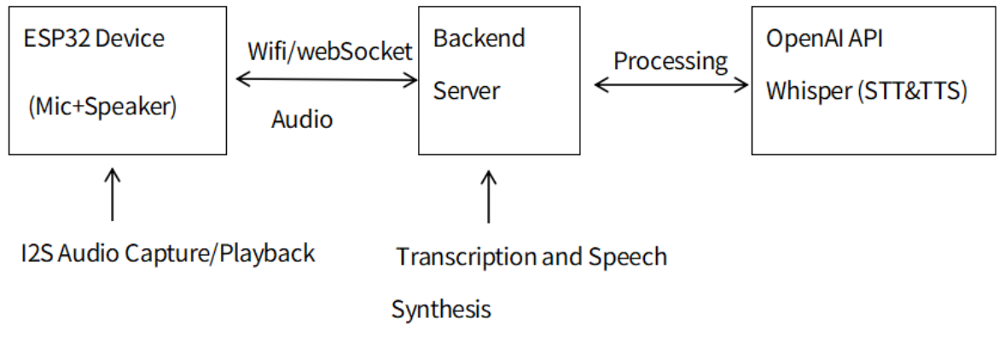

# Bluetooth Speaker with Microphone for ChatGPT Web Voice Interaction (Enhanced Version)


## 🌐 ESP32 as Front-End with WebSocket Communication to Backend Server

This project implements a **real-time audio streaming device** using the **ESP32 microcontroller**, functioning as both a **microphone** and **speaker** interface. The ESP32 establishes a **WebSocket connection** to a backend server, enabling two-way voice interaction with **OpenAI's Whisper and TTS services** for speech recognition and synthesis.

---

### ✅ System Overview

- **Microcontroller**: ESP32 (WROOM-32)
- **Microphone**: INMP441 I2S digital MEMS microphone
- **Speaker**: I2S DAC for audio output
- **Connection**: WebSocket over WiFi
- **Protocol**: Binary WebSocket frames for audio, text frames for control
- **Server**: Backend processing server at 192.168.50.62:3000
- **Audio Services**: OpenAI Whisper (speech-to-text) and TTS (text-to-speech)

---

### 🔁 Flowchart of Audio Communication



---

### 🛠️ Features

- **Real-time bidirectional audio streaming** via WebSocket protocol
- **Dual-core processing** utilizing both ESP32 cores for parallel audio tasks
- **I2S digital audio interface** for high-quality sound capture and playback
- **Format conversion** between 16-bit PCM and 32-bit float audio formats
- **Persistent WebSocket connection** with automatic reconnection handling
- **Integration with OpenAI services** for intelligent voice interaction

---

### 💻 Dual-Core Implementation

The ESP32's dual-core architecture is leveraged to optimize audio processing performance:

```cpp
// Create tasks for dual-core processing
xTaskCreatePinnedToCore(
  microphoneTask,     // Task function
  "MicrophoneTask",   // Name
  8192,               // Stack size
  NULL,               // Parameters
  1,                  // Priority
  &micTaskHandle,     // Task handle
  0                   // Run on Core 0
);

xTaskCreatePinnedToCore(
  speakerTask,        // Task function
  "SpeakerTask",      // Name
  8192,               // Stack size
  NULL,               // Parameters
  1,                  // Priority
  &speakerTaskHandle, // Task handle
  1                   // Run on Core 1
);
```

This separation of tasks allows:
- **Core 0**: Dedicated to microphone audio capture and WebSocket transmission
- **Core 1**: Manages incoming audio data and speaker output
- **Thread-safe communication**: Uses mutex-protected buffers for data exchange
- **Independent processing**: Audio input and output operate without blocking each other

---

### 📋 Implementation Details

| Component | Implementation |
|-----------|----------------|
| WiFi Connection | Connects to network "ISC-SG" for server access |
| WebSocket Client | Connects to ws://192.168.50.62:3000/audio endpoint |
| Audio Capture | 16kHz, 16-bit PCM input from INMP441 on I2S_NUM_1 |
| Audio Playback | 32kHz, 16-bit PCM output to speaker on I2S_NUM_0 |
| Task Distribution | Core 0: Microphone task, Core 1: Speaker task |
| Control Protocol | "START_LISTENING", "STOP_LISTENING", "START_SPEAKING", "STOP_SPEAKING" |
| Speech Recognition | Captured audio sent to server, processed by OpenAI Whisper API |
| Speech Synthesis | Text responses converted to speech using OpenAI TTS API |

---

### ⚠️ Challenges Faced

| Issue | Description | Solution |
|-------|-------------|----------|
| Format Incompatibility | Server expected 32-bit float, but speaker needed 16-bit PCM | Implemented format conversion with appropriate scaling |
| Task Synchronization | Microphone and Speaker tasks needed coordination | Used mutex-protected shared buffers and status flags |
| Empty Files on Server | Server received audio but couldn't process it for Whisper | Audio format mismatch investigation; file format needs adjustment |
| I2S Configuration | Initial I2S setup issues for both mic and speaker | Properly configured I2S parameters for both ports |
| OpenAI Format Requirements | Whisper expects specific audio format (PCM_F32LE) | Ensured correct format conversion before transmission |

---

### 🧪 Test Results

| Component | Status |
|-----------|--------|
| WiFi Connection | ✅ Stable |
| WebSocket Communication | ✅ Reliable connection established |
| Audio Transmission (ESP32→Server) | ✅ Data packets sent successfully |
| Audio Reception (Server→ESP32) | ✅ Binary frames received |
| Audio Playback | ✅ Confirmed working with test tones |
| Dual-Core Performance | ✅  Successfully distributing processing across cores |
| Server Processing | ✅ Empty files received by Whisper |

---

### 🔄 Communication Flow

1. **ESP32 connects** to WiFi network and establishes WebSocket connection
2. **Server sends** "START_LISTENING" when ready to receive audio
3. **Microphone task (Core 0)** captures audio via I2S interface
4. **Audio data** is transmitted as binary WebSocket frames to server
5. **Server processes** audio with OpenAI Whisper for speech recognition
6. **Response text** is generated and converted to speech using OpenAI TTS
7. **Audio response** is sent back to ESP32 as binary WebSocket frames
8. **Speaker task (Core 1)** plays received audio through the I2S DAC