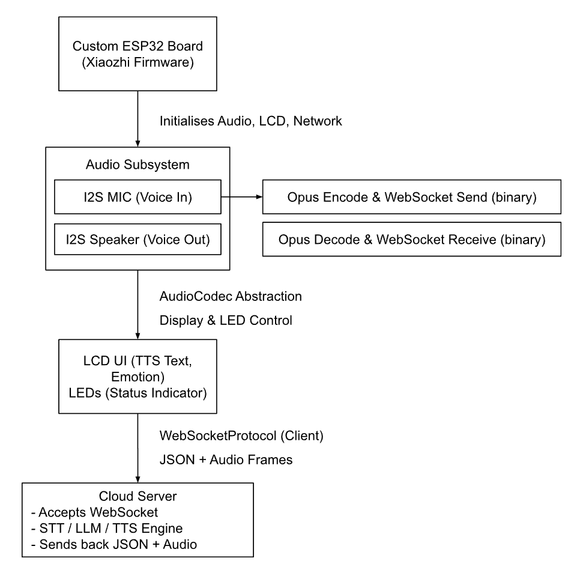

# 📘 Porting Xiaozhi Framework to Custom ESP32 Extension Board

## 🔧 Overview of Xiaozhi Framework

The **Xiaozhi system** is an intelligent, voice-interactive framework designed for embedded devices like the ESP32-S3. It supports real-time communication with cloud services, natural language understanding, and interactive UI output. Its architecture is modular and object-oriented, enabling high portability across hardware platforms.

### 🔹 Key Architecture Components

* **Audio Capture and Playback**
  Utilizes the ESP32-S3’s I2S interface to stream audio from microphones and to speakers in real time.

* **WebSocket-Based Communication**
  Uses a hybrid JSON and binary protocol for STT (Speech-to-Text), TTS (Text-to-Speech), and device command handling.

* **Object-Oriented Server Integration**
  Each device is treated as an instance of a class on the cloud, inheriting from a shared base class to streamline code reuse and scalability.

---

## 🛠️ Porting Xiaozhi to Our Extension Board

To integrate Xiaozhi into our custom ESP32 extension board, several adaptations were made:

### 🎧 Audio Subsystem

* Reworked the **audio driver layer** to support our specific codec chip and I2S configuration.
* The abstract audio interface remained unchanged, highlighting the benefit of Xiaozhi's layered architecture.

### 📺 LCD and UI Output

* Adapted display routines to use **ESP-IDF-compatible libraries** for our LCD driver.
* Maintained the abstract UI layer without significant structural changes.

---

## 🔄 System Flow

---

## 🌟 Features

* **Real-Time Voice Interaction** over WebSocket (UDP optional)
* **I2S Audio Pipeline** with Opus codec (16kHz, mono)
* **BOOT Key Input** with short- and long-press detection (e.g., wake vs. cancel)
* **Offline Wake Word** via ESP-SR for low-latency activation
* **Multi-language STT** (Mandarin, Cantonese, English, Japanese, Korean)
* **Voiceprint Recognition** with 3D Speaker
* **Large Model TTS** (e.g., Volcengine, CosyVoice)
* **LLM Response Generation** (Qwen, DeepSeek, Doubao compatible)
* **Custom AI Characters** with adjustable tone and prompts
* **Short-Term Memory** with self-summarizing dialogue
* **OLED/LCD Display** for:

  * Signal strength
  * Transcribed speech
  * Assistant response
  * Emoji/avatar expressions
* **Bilingual UI**: Chinese and English support (voice and display)

---

## 🚧 Challenges & Solutions

| Issue                    | Description                                    | Solution                                                |
| ------------------------ | ---------------------------------------------- | ------------------------------------------------------- |
| Codec incompatibility    | Opus encoding errors from sample rate mismatch | Reconfigured I2S + encoder to 16kHz mono                |
| LCD driver mismatch      | Default driver unsupported for our screen      | Rewrote SPI display driver using ESP-IDF display libs   |
| GPIO pin conflict        | Shared pins between LED and other functions    | Resolved via updated pin remapping in board definitions |
| WebSocket handshake fail | Token not accepted by server                   | Corrected `Authorization: Bearer <token>` header format |

---

## ✅ Test Results

| Component               | Status                            |
| ----------------------- | --------------------------------- |
| I2S Microphone Input    | ✅ Clear Opus audio stream         |
| WebSocket Handshake     | ✅ Successful with headers         |
| STT & TTS Functionality | ✅ Accurate recognition/playback   |
| LCD Output              | ✅ Dialogue & expressions rendered |
| Network Recovery        | ✅ Stable auto-reconnect           |

---

## 📌 Conclusion

This project successfully demonstrates the portability and extensibility of the Xiaozhi framework when adapted to custom ESP32 hardware. Through minimal changes in low-level drivers and leveraging its modular design, Xiaozhi delivers a robust voice-interactive experience with rich multilingual support and real-time cloud integration.

