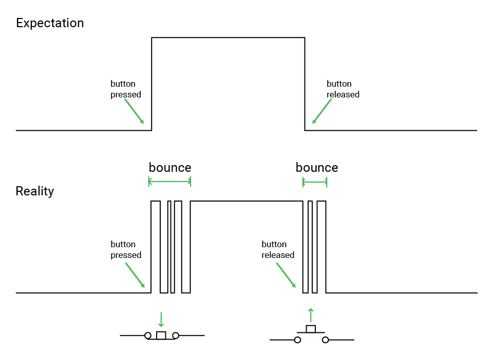

# 🔁 Button Debouncing on ESP32 with Arduino

## 🧠 Part 1: What Is Button Debouncing?

When you press a button, the contacts inside don’t make a perfect connection immediately. Instead, they **physically bounce** for a few milliseconds. This causes the signal to fluctuate rapidly between HIGH and LOW — even though you pressed the button just once.

### 🧨 The Problem:
Without debounce logic, your ESP32 may detect **multiple button presses** for one actual press.

---

## 🔍 Part 2: What Does Bounce Look Like?



The microcontroller sees this and thinks:
> "The button was pressed and released multiple times!"

---

## 💡 Part 3: How Debouncing Fixes It

Absolutely! Let’s break down the **debounce logic** step by step in a way that makes it super easy to understand:

---

## 🧠 Why Do We Need Debouncing?

When you press a button, it doesn’t make a **clean contact** right away. Instead, the metal inside the button might **vibrate or “bounce”**, causing the signal to flicker between **HIGH and LOW** rapidly for a few milliseconds.

To us, that’s just a single press.  
To the ESP32? It looks like this:

```
LOW → HIGH → LOW → HIGH → LOW → (finally stable)
```

If we don’t filter that out, the ESP32 might think we pressed the button **5 times** instead of once.

---

## 🔁 So What’s the Debounce Logic?

We use a **simple idea**:  
> "Only accept a button press if the signal stays the same for a short amount of time (e.g., 50 milliseconds)."

### 🧩 Step-by-Step Logic:

1. 🔍 **Read the button's current state** using `digitalRead()`.

2. 🧠 **Compare it to the previous reading** (`lastButtonState`):
   - If it's different, it might be a real press — **or just a bounce**.
   - So we **reset a timer** (`lastDebounceTime`) to note *when* the change was first seen.

3. ⏱ **Wait a short time** (e.g. 50 ms) to see if the new state stays the same.

4. ✅ If the state is still the same after the delay, **accept it as a real change**.

5. 🚀 Finally, if the new (debounced) state is `LOW` (button pressed), **perform the action**, like printing to serial or toggling an LED.

---

## 🔌 Part 4: Wiring the Button

Same as [GPIO Digital Input: Using a Button with ESP32](GPIO_Input_Arduino\button_input.md)

#### 🧩 Option A: Using an Extension Board (Recommended for Beginners)
If you're using an **ESP32 extension board**, good news! 🎉  
- You don’t need to worry about pull-up resistors.
- Just use female-to-male jumper wire and connect corrdingly. 

| LED Board Pin | ESP32 Pin        |
|---------------|------------------|
| GND           | GND              |
| 5V           | 5V              |
| LED1          | GPIO2 (D2)     |
| SW1          | GPIO14     |
- The board handles resistor setup internally, making things **safer and more reliable**.

#### 🧪 Option B: Breadboard Wiring (Manual Setup)

| Component     | ESP32 Pin     |
|---------------|---------------|
| One side of button | GND (ground) |
| Other side (diagonally) | GPIO14 |
| Pull-up resistor (10kΩ) | Between GPIO14 and 3.3V |
| LED1          | GPIO12 (D12)     |

🔧 Or, skip the external resistor by using `INPUT_PULLUP` mode in your code.

> Note: 
> be careful with the direction of LED and remeber to connect a **resistor** in series with the LED
> - **Long leg = positive (anode)**  
> - **Short leg = negative (cathode)** 

**Basic Diagram (Text version):**

```
 3.3V ──┐
        │
       [10kΩ]
        │
GPIO14 ─┴──── Button ───── GND
```

---

## 🧾 Part 5: Arduino Code – Debounced Button Toggle

Here’s the full code that:
- Debounces the button
- Toggles the LED on each press
- Prints the result over UART

```cpp
const int buttonPin = 14;   // GPIO connected to button
const int ledPin = 2;       // LED pin (built-in or external)

int buttonState = HIGH;             // Current debounced state
int lastButtonState = HIGH;         // Last raw state
unsigned long lastDebounceTime = 0; // Timestamp of last change
const unsigned long debounceDelay = 50; // Delay in ms

bool ledOn = false; // LED state

void setup() {
  Serial.begin(115200);               // Start Serial Monitor
  pinMode(buttonPin, INPUT_PULLUP);   // Internal pull-up: HIGH when not pressed
  pinMode(ledPin, OUTPUT);            // LED output
}

void loop() {
  int reading = digitalRead(buttonPin); // Raw state

  // If state changed, reset timer
  if (reading != lastButtonState) {
    lastDebounceTime = millis();
  }

  // If stable for debounceDelay, accept new state
  if ((millis() - lastDebounceTime) > debounceDelay) {
    if (reading != buttonState) {
      buttonState = reading;

      // Only toggle on button press (LOW = pressed due to pull-up)
      if (buttonState == LOW) {
        ledOn = !ledOn;
        digitalWrite(ledPin, ledOn ? HIGH : LOW);
        Serial.println(ledOn ? "LED ON" : "LED OFF");
      }
    }
  }

  lastButtonState = reading; // Save reading for next loop
}
```

---


### ⚠️ A Note on `delay()`-Based Debouncing: Not Ideal for Complex Systems

In our current example, we used a **simple delay-based software debounce** using `delay()` or `millis()`. This is great for beginners and small projects, but in more complex systems, **this approach is not recommended**.

#### Why?
> In complex and multitasking microcontroller systems, using simple looping delays for debounce can **waste valuable CPU time** and **reduce system responsiveness and real-time performance**.

In other words, the CPU is stuck waiting during that 50ms delay — doing nothing else — which is a huge problem if your system needs to handle multiple tasks or respond quickly to other events.

---

### ✅ Better Approaches for Debouncing

1. **Timer Interrupts**
   - Set up a hardware timer that triggers an interrupt at regular intervals.
   - Use the interrupt to check and update button states.
   - Keeps your main loop free for other tasks.

2. **Non-blocking millis()-based Debounce**
   - Instead of `delay()`, use `millis()` to track time and debounce without halting the loop.
   - More efficient and allows multitasking within the main loop.

---

### 🧠 Comparison Table

| Method                  | Blocking? | Real-Time Friendly? | Difficulty | Recommended For             |
|-------------------------|-----------|----------------------|------------|------------------------------|
| `delay()` Debounce      | ✅ Yes     | ❌ No                | ⭐ Easy     | Beginners, simple projects   |
| `millis()` Debounce     | ❌ No      | ✅ Yes               | ⭐⭐ Medium  | Projects with multitasking   |
| Timer Interrupt Debounce| ❌ No      | ✅✅ Very Good       | ⭐⭐⭐ Advanced| High-performance applications|

