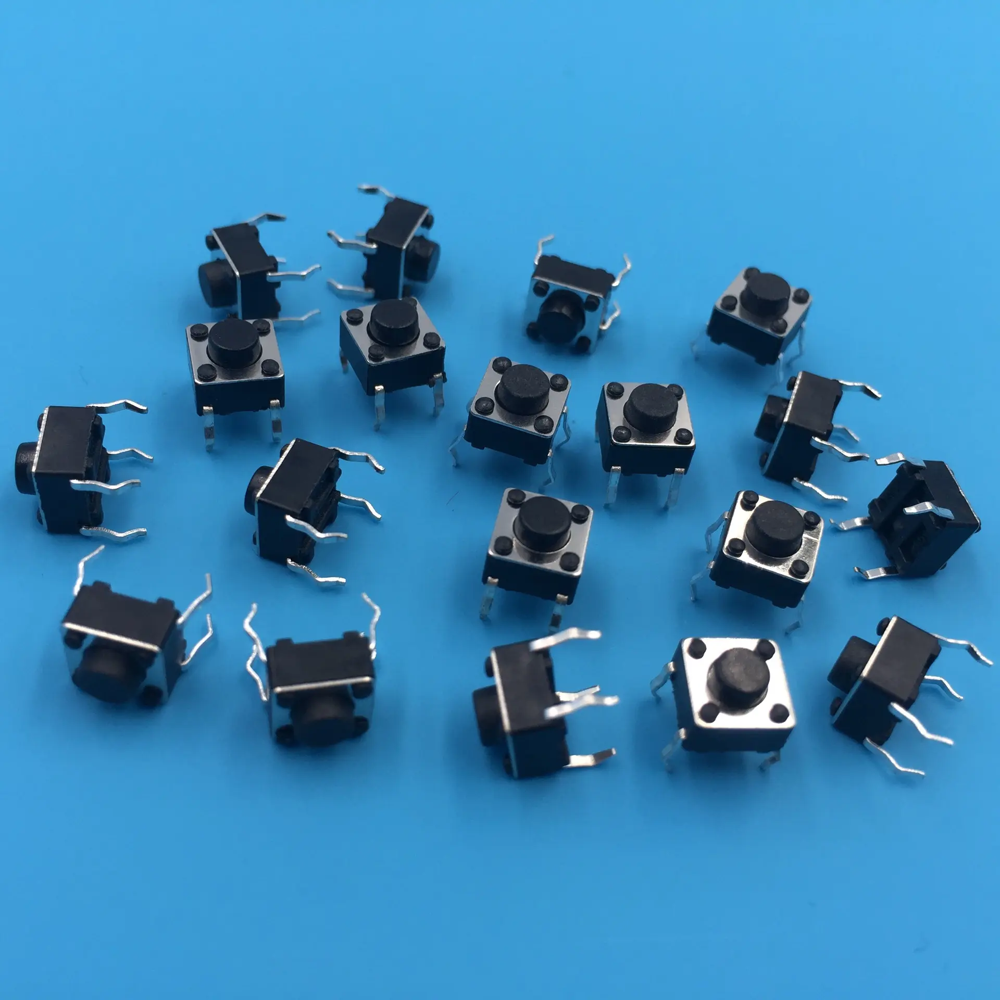

## 🕹️ GPIO Digital Input: Using a Button with ESP32

### 1️⃣ What’s a Button and How It Works  
A button is a simple but essential electronic switch — **press it**, and it completes the circuit; **release it**, and it breaks the connection. Clean and straightforward!

Most buttons come with **two sets of pins (contacts)**. When you press the button, it connects the two pins in a pair, allowing current to flow.  

For those common **4-pin tactile buttons**, here's a neat tip: the pins that are **farther apart are internally connected**, and the ones **closer together form the switching pair**. Ideally, use a multimeter to test the connections — but if you're just prototyping and need a quick setup, **connecting the pins diagonally always works!**

> Now here’s the best part —  
👉 **If you’re using an ESP32 extension board**, everything gets even easier.  
You don’t need to worry about resistors in series or confusing pin connections. The extension board handles the pull-up/pull-down resistors and power routing for you, making your setup **much safer, cleaner, and far less prone to wiring mistakes**. It's a great way to reduce the chances of errors or damaging your board.


---

### 2️⃣ 🔌 Wiring the Button  

#### 🧩 Option A: Using an Extension Board (Recommended for Beginners)
If you're using an **ESP32 extension board**, good news! 🎉  
- You don’t need to worry about pull-up resistors.
- Just use female-to-male jumper wire and connect corrdingly. 

| LED Board Pin | ESP32 Pin        |
|---------------|------------------|
| GND           | GND              |
| 5V           | 5V              |
| LED1          | GPIO2 (D2)     |
| SW1          | GPIO14     |
- The board handles resistor setup internally, making things **safer and more reliable**.

#### 🧪 Option B: Breadboard Wiring (Manual Setup)

| Component     | ESP32 Pin     |
|---------------|---------------|
| One side of button | GND (ground) |
| Other side (diagonally) | GPIO14 |
| Pull-up resistor (10kΩ) | Between GPIO14 and 3.3V |
| LED1          | GPIO12 (D12)     |

🔧 Or, skip the external resistor by using `INPUT_PULLUP` mode in your code.

> Note: 
> be careful with the direction of LED and remeber to connect a **resistor** in series with the LED
> - **Long leg = positive (anode)**  
> - **Short leg = negative (cathode)** 

**Basic Diagram (Text version):**

```
 3.3V ──┐
        │
       [10kΩ]
        │
GPIO14 ─┴──── Button ───── GND
```

---

### 3️⃣ 🧠 Arduino Code: Read Button + Control LED + Print to UART

```cpp
int buttonPin = 14;  // GPIO connected to the button
int ledPin = 2;      // Built-in LED (change if using external)

void setup() {
  Serial.begin(115200);              // UART Serial output
  pinMode(buttonPin, INPUT_PULLUP);  // Use internal pull-up resistor
  // pinMode(buttonPin, INPUT_PULLDOWN);     // Use internal pull-down resistor //uncomment to see what happens 
  pinMode(ledPin, OUTPUT);           // LED output
}

void loop() {
  int buttonState = digitalRead(buttonPin);  // Read button

  // Note: LOW = Pressed, because of pull-up logic
  Serial.print("Button is ");
  Serial.println(buttonState == LOW ? "PRESSED" : "RELEASED");

  // Turn on LED when button is pressed
  digitalWrite(ledPin, buttonState == LOW ? HIGH : LOW);

  delay(100);  // Avoid spamming output
}
```
<video controls src="63b4dcfbbaf0fd9a243b1b99e28f7aeb.mp4" title="Title"></video>

### 📥 Configure Input Modes in Arduino (ESP32)

You can configure GPIO input using `pinMode()` in Arduino:

```cpp
pinMode(14, INPUT);           // Basic input – needs external resistor
pinMode(14, INPUT_PULLUP);    // Enables internal pull-up resistor
pinMode(14, INPUT_PULLDOWN);  // Enables internal pull-down
```

#### 🧲 INPUT
- No internal resistor.
- You need to add an **external pull-up or pull-down resistor**.

#### 🔼 INPUT_PULLUP
- Uses the **internal pull-up resistor**.
- Pin defaults to **HIGH (3.3V)**.
- When you press the button, it gets pulled **LOW (0V)**.

#### 🔽 INPUT_PULLDOWN 
- Uses the **internal pull-down resistor**.
- Pin defaults to **LOW (0V)**.
- When you press the button, it gets pulled **HIGH (3.3V)**.

> Give it a Try ! 
```cpp
pinMode(14, INPUT_PULLDOWN);
```


---

### 📊 Reading the Pin

Use `digitalRead(pin)` to get the current state:

```cpp
int state = digitalRead(14);
if (state == HIGH) {
  Serial.println("Pin is HIGH (3.3V)");
} else {
  Serial.println("Pin is LOW (0V)");
}
```

---

### 🧠 Tip: Know Your Logic!

| Mode             | Default State | Pressed State |
|------------------|----------------|----------------|
| INPUT + pull-down | LOW            | HIGH           |
| INPUT_PULLUP      | HIGH           | LOW            |

So depending on the setup, **pressed = HIGH or LOW**. Make sure your code matches your hardware.
