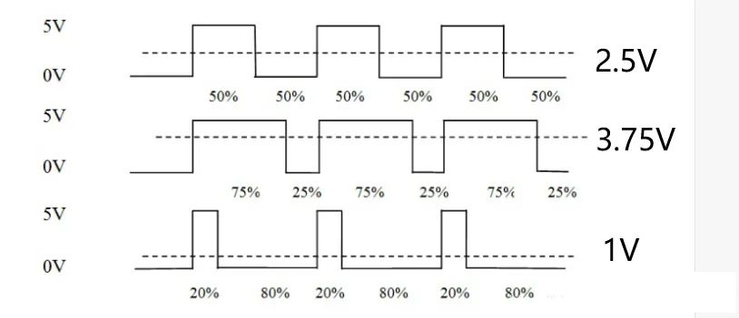

# 🌬️ PWM Breathing LED 

A **breathing LED** is an LED that smoothly fades in and out — just like how you breathe in and out slowly. This effect is often seen on power buttons or ambient lighting.

We'll use **PWM (Pulse Width Modulation)** on an **ESP32** to control the LED's brightness and simulate the breathing effect.

---

## ⚡ What is PWM (Pulse Width Modulation)?

**PWM**, short for **Pulse Width Modulation**, is a powerful and widely-used technique that allows microcontrollers to control analog devices using digital outputs. It plays an essential role in various fields, including **measurement**, **communication**, and **power control/conversion**.

---

## 🧠 How Does PWM Work?

Imagine sending out a stream of **square waves** — signals that switch rapidly between ON (HIGH) and OFF (LOW). By adjusting two key things:

- **Frequency** – how fast the signal repeats in one second  
- **Duty Cycle** – how much of that time the signal stays ON (HIGH)

...you can actually control the **average voltage** sent to a device.

Here’s the magic:  
👉 If you keep the frequency constant and only adjust the **duty cycle**, you can **smoothly change the output power** — like dimming an LED or adjusting a motor’s speed.

For example:


It’s like tapping a switch really fast — the longer you hold it on, the more power gets through!


This lets you control things like:
- LED brightness
- Motor speed
- Sound volume
- Heating elements

---


## 📦 What You’ll Need

| Component     | Quantity |
|---------------|----------|
| ESP32 Dev Board | 1        |
| LED (5mm)     | 1        |
| 330Ω – 1kΩ Resistor | 1  |
| Breadboard    | 1        |
| Jumper wires  | A few    |

> 🔧 If you're using your **ESP32 extension board**, you can skip the breadboard and just connect the LED directly using jumper wires and the board's labeled GPIO headers.

---

## 🔌 Circuit Diagram

- **LED anode (long leg)** → GPIO pin (e.g., D13 / GPIO13)  
- **LED cathode (short leg)** → Resistor → **GND**

```
ESP32 GPIO13  ──►│──┬── Resistor (330Ω–1kΩ) ──► GND
                LED
```

📌 Make sure you pick a PWM-capable GPIO pin (like GPIO13, GPIO12, GPIO14, etc.)

---

## 🧑‍💻 Arduino Code

```cpp
// Define the LED pin
#define LED_PIN 12

void setup() {
  // Set the LED pin as output
  pinMode(LED_PIN, OUTPUT);
}

void loop() {
  // Fade in
  for (int brightness = 0; brightness <= 255; brightness++) {
    analogWrite(LED_PIN, brightness);  // Set brightness level (0–255)
    delay(10);  // Wait to control breathing speed
  }

  // Fade out
  for (int brightness = 255; brightness >= 0; brightness--) {
    analogWrite(LED_PIN, brightness);
    delay(10);
  }
}
```

---

## 🔥 What’s Happening Here?

`analogWrite()` sends PWM signals to simulate varying voltage
A loop gradually increases brightness, then decreases it
The `delay(10)` controls how fast the LED "breathes"

<video controls src="f717312bc1497d44dddf24eb3426766e.mp4" title="Title"></video>
---

## 🔧 What is `analogWrite()`?

When you call:

```cpp
analogWrite(pin, value);
```

You're telling the microcontroller to:
- Output a **PWM signal** on that `pin`
- With a **duty cycle** based on the `value` (between 0–255)

| `analogWrite()` Value | Duty Cycle | Brightness Level |
|------------------------|------------|------------------|
| `0`                    | 0%         | OFF              |
| `127`                  | ~50%       | Half brightness  |
| `255`                  | 100%       | Full brightness  |

Let’s say you write:

```cpp
analogWrite(LED_PIN, 128);
```

This means the LED is **ON 50% of the time** and **OFF 50% of the time**, repeated thousands of times per second. Your eyes blend this into a **dimmed brightness**.

---

## ⚠️ Note for ESP32 Users

On traditional Arduino boards (like Uno), `analogWrite()` is built-in.

On **ESP32**, `analogWrite()` was not originally supported, but **recent versions of the ESP32 Arduino core now include it** as a simplified wrapper using the `ledcWrite()` system under the hood.

So make sure:
- You have ESP32 Arduino core v2.0.5 or newer
- You're using a **PWM-capable pin** (most GPIOs work, ckeck pin layout to double confirm)

---


## 🎨 Want to Enhance It?

You can:
- Add a **second LED** for dual breathing
- Control speed with a **potentiometer**
- Sync it with a **heartbeat sensor**
- Create **nonlinear fade** using `sin()` or easing functions for a more natural look
