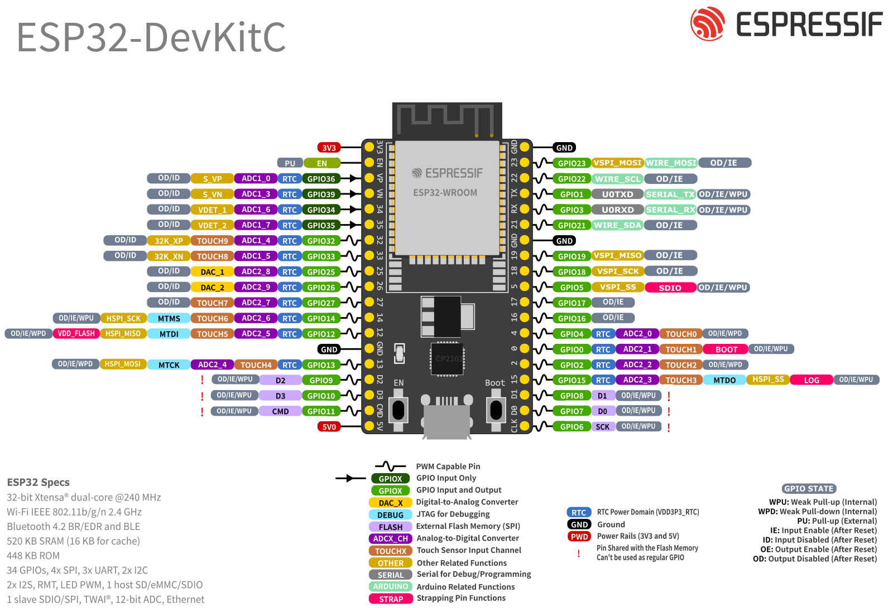

# 🌈 Running Light Experiment (ESP32 + Arduino)

In the previous lesson, we learned how to blink a single LED. This time, we’re going a step further and building a **running light** effect using multiple LEDs. It’s a classic project that helps you understand arrays, loops, and GPIO control in embedded systems.

---

## 🔧 Hardware Circuit Design
### Option A: Use Your ESP32 **Extension Board** (Recommended)

### ✅ **Wiring Plan**
Use female-to-male jumper wires

| ESP32 GPIO Pin | ESP32 Label | Connects To | LED on Module |
|----------------|-------------|-------------|----------------|
| GPIO13         | D13         | LED1        | D1 (Red)       |
| GPIO12         | D12         | LED2        | D2 (Yellow)    |
| GPIO14         | D14         | LED3        | D3 (Yellow)    |
| GPIO27         | D27         | LED4        | D4 (Green)     |
| GND            | GND         | GND         | Common GND     |

> ⚠️ **Important:** The LED module expects you to connect each GPIO pin to the **LEDx** pin (anode), and share a **common GND** with ESP32.

> #### 🧠 **Understanding the Circuit**
> Each LED already has a **series resistor** on the board, so you can connect the ESP32 GPIO pins **directly** to the LEDx inputs — no external resistors needed.


### Option B: Use a Breadboard (Alternative)
### 🧰 Bill of Materials (BOM)

| Item                | Quantity |
|---------------------|----------|
| 5mm LED (through-hole) | 5        |
| 1kΩ Resistor        | 5 (or 1 shared) |
| Jumper wires        | Several  |
| Breadboard          | 1        |

Each LED’s **positive leg (anode)** is connected to a different GPIO pin. Each LED is connected in series with a resistor, and the **negative leg (cathode)** goes to **GND**.

> ⚠️ *You can use a single resistor for all LEDs if you multiplex carefully, but we recommend one resistor per LED for safety and clarity.*

---

## 🧩 Using Your Extension Board

If you’re using your **custom ESP32 extension board**, simply plug the LEDs directly into the labeled GPIO ports like this:

```
[D13] --> LED1 (anode)
[D12] --> LED2 (anode)
[D14] --> LED3 (anode)
[D27] --> LED4 (anode)
[D26] --> LED5 (anode)
Each LED cathode --> Resistor --> GND
```

✅ No breadboard required if your extension board exposes GPIO headers!  
⚠️ Still remember to add resistors to limit current.

---

## 💻 Software: Program Design 

We’ll walk through **3 variations** of the running light effect:

---

### 🔹 1. Standard Running Light (One-way ON → OFF)

Each LED turns on one by one from left to right, then turns off in the same order.

```cpp
// Define the GPIO pins connected to the 4 LEDs
int pin_list[4] = {13, 12, 14, 27};

// Calculate the number of LEDs using the array size
int size = sizeof(pin_list) / sizeof(pin_list[0]);

void setup() {
  // Set each pin in the list as OUTPUT
  for (int i = 0; i < size; i++) {
    pinMode(pin_list[i], OUTPUT);
  }
}

void loop() {
  // Turn on LEDs one by one from left to right
  for (int i = 0; i < size; i++) {
    digitalWrite(pin_list[i], HIGH);  // Set the pin HIGH to turn on LED
    delay(50);                         // Wait for 50 milliseconds
  }

  // Then turn them off one by one from left to right
  for (int i = 0; i < size; i++) {
    digitalWrite(pin_list[i], LOW);   // Set the pin LOW to turn off LED
    delay(50);                         // Wait before turning off next LED
  }
}
```
<video controls src="db8dc17bd95c9d9b9d821e062aaf5c54.mp4" title="Standard Running Light"></video>
---

### 🔁 2. Back-and-Forth Running Light (ON → ← OFF)

Now we make the LEDs light up from left to right and then back from right to left, like a wave.

```cpp
int pin_list[4] = {13, 12, 14, 27};
int size = sizeof(pin_list) / sizeof(pin_list[0]);

void setup() {
  for (int i = 0; i < size; i++) {
    pinMode(pin_list[i], OUTPUT);  // Initialize all LEDs as OUTPUT
  }
}

void loop() {
  // Turn on LEDs from left to right
  for (int i = 0; i < size; i++) {
    digitalWrite(pin_list[i], HIGH);
    delay(100);
  }

  // Then turn them off from right to left (reverse)
  for (int i = size - 1; i >= 0; i--) {
    digitalWrite(pin_list[i], LOW);
    delay(100);
  }
}
```
<video controls src="f37897fe0096fc192a0ed795a791aec7.mp4" title="Title"></video>
---

### ➡️ 3. Shifting Light (Single LED “Moving”)

This version creates a **“moving dot”** effect. Only one LED is on at any time, giving a clean shifting illusion.

```cpp
int pin_list[4] = {13, 12, 14, 27};
int size = sizeof(pin_list) / sizeof(pin_list[0]);

void setup() {
  // Set all pins as OUTPUT
  for (int i = 0; i < size; i++) {
    pinMode(pin_list[i], OUTPUT);
  }
}

void loop() {
  for (int i = 0; i < size; i++) {
    // Turn on the current LED
    digitalWrite(pin_list[i], HIGH);

    // Turn off the previous LED
    if (i > 0) {
      digitalWrite(pin_list[i - 1], LOW);
    } else {
      // If it's the first LED, turn off the last one to complete the loop
      digitalWrite(pin_list[size - 1], LOW);
    }

    delay(250);  // Slower speed to visualize movement
  }
}
```
<video controls src="76aa4a0b02448a396511ff837daac3b4.mp4" title="Title"></video>
---

## 📍 GPIO Pin Reference

Need help locating the pins?
Want to use other GPIO pins? 
🔗 **ESP32 DOIT Dev Board Pinout Diagram** :  


Using ESP32S3 ?
[ESP32-S3 Datasheet](https://docs.espressif.com/projects/esp-idf/en/v5.2.2/esp32s3/hw-reference/esp32s3/user-guide-devkitc-1.html)

Using ESP32C3 ?
[ESP32-C3 Datasheet](https://docs.espressif.com/projects/esp-idf/en/v5.0/esp32c3/hw-reference/esp32c3/user-guide-devkitc-02.html?utm_source=chatgpt.com)


Use this guide to verify that the GPIO pins you selected are safe and not reserved for boot or special functions.

---

## 🧠 Bonus: What’s the Principle Behind a Running Light?

This project is all about:
- **GPIO Output**: We use GPIOs to send voltage to LEDs.
- **Arrays**: Store multiple pin numbers to simplify control.
- **Loops**: Iterate through the array to light up LEDs in sequence.
- **Timing**: Use `delay()` to control the speed of the lighting effect.

You're using code to create **time-based visual patterns** — it’s how things like light strips and LED displays are made!
