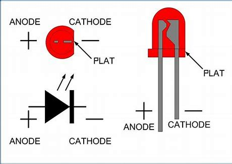
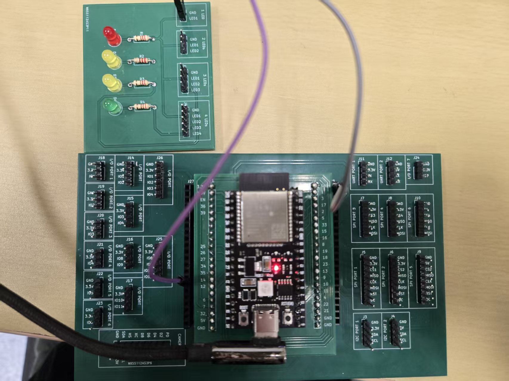
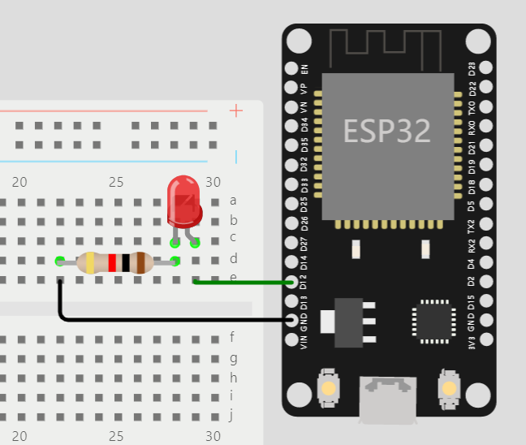

# 💡 GPIO Output – Light Up and Blink an LED  

When learning any microcontroller, one of the simplest yet most essential experiments is controlling an LED using a GPIO pin. This lesson will walk you through how to **light up and blink an LED** on the **ESP32**, and now includes instructions on using the **custom extension board** you designed!

✅ By the end of this tutorial, you’ll:
- Understand GPIO output basics
- Light up and blink an LED
- Learn how to use your **custom extension board**
- Get familiar with ESP32 pin configurations

---

## 🧠 Basic Concepts

### 1. What is a GPIO Pin?

**GPIO** stands for **General Purpose Input/Output**. These are the pins on the ESP32 that can either send or receive electrical signals.

On the ESP32 board, you’ll notice pins labeled with “D” like **D2, D4, D15** — these are GPIO pins. Today, we’ll focus on **output**, where a pin sends out a voltage signal.

#### ⚡ What is a voltage level?

Microcontrollers "talk" using **electricity** in the form of **voltage levels**, often referred to as **logic levels** in digital electronics.

In simple terms:
- **HIGH = On = Voltage Present** (usually 3.3V on ESP32)
- **LOW = Off = No Voltage or near 0V**

By changing the voltage on a GPIO pin, we can **turn things on and off**. For example:
- Sending a **HIGH** signal to an LED pin makes it glow.
- Sending a **LOW** signal turns it off.

> Exact thresholds may vary slightly — feel free to test and confirm!


> 📐 How Many GPIOs Are There?
> The ESP32 has **30+ GPIO pins**, and each can serve different roles:
> - Some are **digital-only**
> - Others support **analog input**, **PWM output**, **I²C/SPI/UART communication**, etc.

> Not all pins are equal — some are **input-only**, some are **strapped (used during boot)**, and some should be avoided during startup.
> 🧭 Use this pinout guide to check which pins are safe for your specific application:  
🔗 [ESP32 Pinout Guide (Random Nerd Tutorials)](https://randomnerdtutorials.com/esp32-pinout-reference-gpios/)


---

### 2. What is an LED?

An **LED (Light Emitting Diode)** is a tiny light source that emits light when current flows through it in the correct direction.

- Needs only about **5mA** to light up
- Too much current can **burn it out**, so we add a **resistor** to limit the current
- LED has two legs:  
  - **Long leg = positive (anode)**  
  - **Short leg = negative (cathode)**  
  - Current flows **from anode to cathode** only

> When lit, an LED typically shows a forward voltage drop of about **1.7V**.

---

## 🔌 Hardware Setup

### Option A: Use Your ESP32 **Extension Board** (Recommended)

The extension board is designed to make wiring easier and reduce the possibility of damaging the components.

#### ✅ Steps:
Use female-to-male jumper wires to make the following connections:

| LED Board Pin | ESP32 Pin        |
|---------------|------------------|
| GND           | GND              |
| LED1          | GPIO12 (D12)     |


---


### Option B: Use a Breadboard (Alternative)

If you don’t have your extension board with you, here’s how to wire it on a breadboard:

### 📋 Bill of Materials (BOM)

| Item               | Quantity |
|--------------------|----------|
| LED (through-hole) | 1        |
| 1kΩ Resistor       | 1        |
| Jumper wires       | Some     |
| Breadboard         | 1        |

### 🧩 Circuit Wiring

- Connect **LED’s positive leg (anode)** to **D12** on the ESP32
- Connect a **resistor** in series with the LED
- Connect **LED’s negative leg (cathode)** to **GND**

⚠️ **Important:** Always include the resistor, or your LED could burn out due to excess current!

---

## 💻 Software Design

### 1. Light Up the LED

To light up the LED:
- Set the GPIO pin (D12) as **output**
- Write a **HIGH** signal to the pin

```cpp
// Set LED pin
int led_pin = 12;

void setup() {
  pinMode(led_pin, OUTPUT);       // Set pin as output
  digitalWrite(led_pin, HIGH);    // Turn on the LED
}

void loop() {
  // Nothing here for now
}
```

Upload this code using your Arduino IDE — the LED should turn on!

---

### 2. Make the LED Blink

Now, let’s make it blink! Blinking means:
- Turn the LED on
- Wait for a second
- Turn it off
- Wait again
- Repeat

Here's how to do it:

```cpp
// Set LED pin
int led_pin = 12;

void setup() {
  pinMode(led_pin, OUTPUT);  // Set pin as output
}

void loop() {
  digitalWrite(led_pin, HIGH); // Turn on LED
  delay(1000);                 // Wait 1 second
  digitalWrite(led_pin, LOW);  // Turn off LED
  delay(1000);                 // Wait 1 second
}
```

Upload the code — you’ll see your LED blinking on and off every second.
<video controls src="ce634d663ada75c5fe49fb9b622348c5.mp4" title="LED blinking"></video>


## 🧠 Bonus:
[🌈 Running Light Experiment](LED_RunningLight.md)