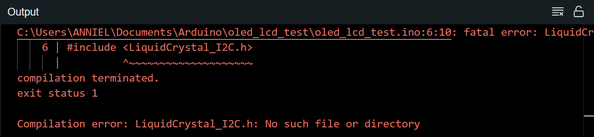
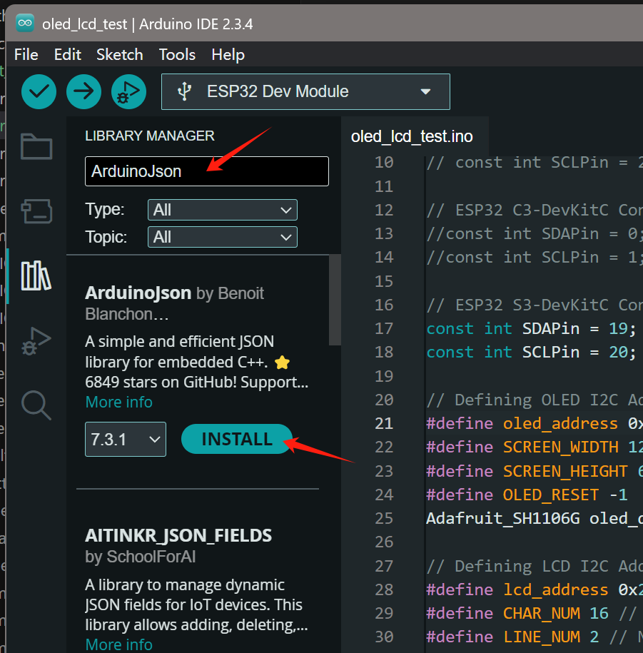
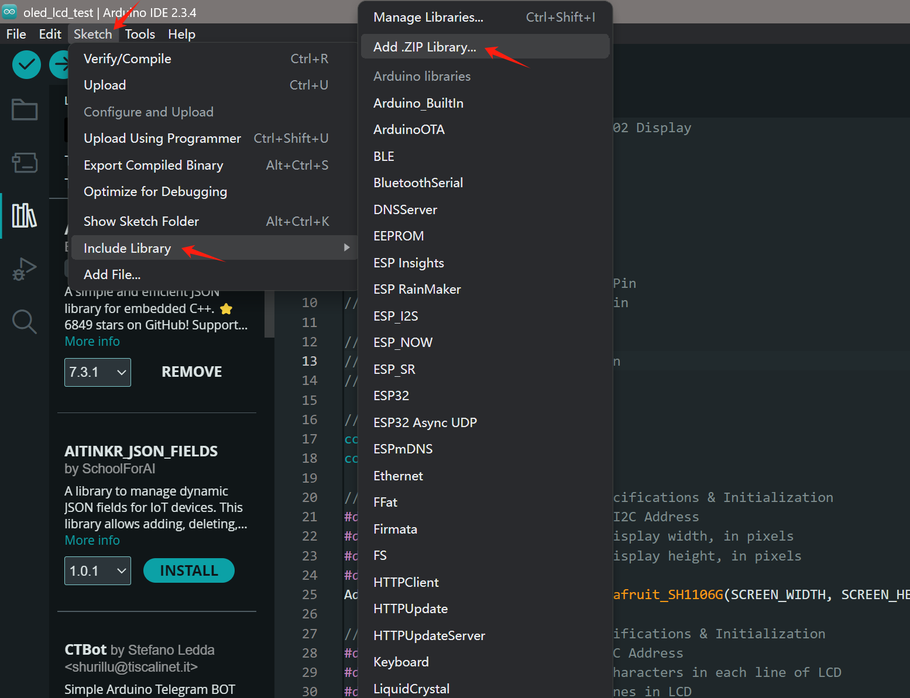

## 📚 How to Add a Library in Arduino IDE 

In Arduino, **libraries** are like toolkits — they add new features so you can use things like sensors, displays, WiFi, or HTTP with just a few lines of code.

This guide walks you through **how to install libraries** in multiple ways using the **Arduino IDE**.

---

### 🧠 What Is a Library?

A library is a collection of code that helps you interface with specific hardware (like sensors, screens) or protocols (like WiFi, HTTP, MQTT).

Example:
```cpp
#include <WiFi.h>         // ESP32 WiFi library
#include <Adafruit_GFX.h> // For graphics drawing on displays
```
> If when you try to compile and show error message similar to: 
> 
> this indicate that you have missing library and you need to install

---

## 🛠️ Method 1: Install via Library Manager (Recommended)

### ✅ Steps:
1. Open **Arduino IDE**
2. Go to **Sketch > Include Library > Manage Libraries...**
3. In the Library Manager window:
   - Type the library name (e.g. `ArduinoJson`, `Adafruit ILI9341`, `ESP32Servo`)
   - Click **Install**
4. Done! You can now use `#include <LibraryName.h>` in your sketch.


🔎 Example search:
- `WiFi` for ESP32 WiFi
- `ArduinoJson` for working with JSON
- `Adafruit GFX` for screen drawing functions

---

## 🧰 Method 2: Install a ZIP Library

Sometimes libraries are downloaded from GitHub or external websites. These are usually `.zip` files.

### ✅ Steps:
1. Download the `.zip` file of the library (e.g. from GitHub)
2. In Arduino IDE:
   - Go to **Sketch > Include Library > Add .ZIP Library...**
3. Select the downloaded `.zip` file
4. The library will be added to your Arduino libraries folder


📦 Example:
Download from  
`https://github.com/bblanchon/ArduinoJson/archive/refs/heads/6.x.zip`

---

## 📁 Method 3: Manual Installation (Advanced)

1. Find your Arduino libraries folder (e.g. `Documents/Arduino/libraries`)
2. Unzip the downloaded library into that folder
3. Restart Arduino IDE

💡 Tip: Make sure the folder name matches the `.h` file inside!

---

## ❓ How to Check If a Library Was Installed

- Go to **Sketch > Include Library**
- You should see the library listed under “**Contributed libraries**”
- You can also try including it in a sketch:
```cpp
#include <ArduinoJson.h> // If no red underline = success!
```

---

## 🧪 Common Libraries for ESP32 Projects

| Library | Purpose |
|--------|---------|
| `WiFi.h` | Connect ESP32 to WiFi |
| `HTTPClient.h` | Perform HTTP requests |
| `ArduinoJson.h` | Parse JSON responses |
| `ESP32Servo.h` | Control servo motors |
| `Adafruit_GFX.h` + `Adafruit_ILI9341.h` | Draw on TFT display |
| `PubSubClient.h` | MQTT for IoT messaging |

---

### 📚 Helpful Links

- 🔗 [Arduino Library Reference](https://www.arduino.cc/reference/en/libraries/)
- 🔗 [ArduinoJson GitHub](https://github.com/bblanchon/ArduinoJson)
- 🔗 [Adafruit GFX Library](https://github.com/adafruit/Adafruit-GFX-Library)

---

Let me know if you'd like a **Part 2** covering:
- How to write your own Arduino library  
- How to organize `.h` and `.cpp` files  
- How to manage library versions for compatibility

Or if you want me to combine this with real ESP32 projects!