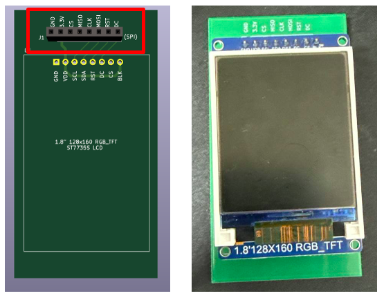

# Introduction to Expansion Board 

The expansion board can be used with ESP32-DevKitC-01, ESP32-S3-DevKitC-01 and ESP32-C3_DevKitC-02.

The expansion board kit consists of the shells for the microprocessor development boards, the expansion board, the display boards for OLED, LCD 1602, LCD ST7735 and LCD ILIILI9341, the pushbuttons board, the led board as well as the temperature and light sensor board.

## Shell Boards

The front view of the shell board shows the pin number connected to the connectors aligned on the expansion board and the back view of the shell board shows the assigned pin values to the I2C, SPI, UART, I/O and Camera Ports on the expansion board.

Below shows the front view of the ESP32-S3-DevKitC-01, ESP32-DevKitC-01 and ESP32-C3_DevKitC-02 in a left to right order.

<h1 align="center">  </h1>

Below shows the back view of the ESP32-S3-DevKitC-01, ESP32-DevKitC-01 and ESP32-C3_DevKitC-02 in a left to right order.

<h1 align="center">  </h1>

## Expansion Board Layout
The expansion board serves as the main body in the expansion board kit and it has many sockets which users can use to connect the microprocessor development board shells to the sensors and actuators.

Below shows the layout of the expansion board. 

<h1 align="center">  </h1>

The red rectangle shows where the shells for the ESP32-DevKitC-01, ESP32-S3-DevKitC-01 and ESP32-C3_DevKitC-02 can be connected. 

The green rectangle shows the UART port, the orange rectangle shows the SPI port and the yellow rectangle shows the I2C port. Do take note that although they are mainly used to connect through UART, SPI or I2C protocols, they can also act as GPIO pins as well.

The dark blue rectangle shows the camera port to interface with the camera. Note that this feature is only applicable to ESP32-S3-DevKitC-01. The pins used here can also work in GPIO mode as well.

The cyan rectangle shows the additional sockets that users can connect to external boards such as a breadboard. The pin assignments are shown below. 

<h1 align="center">  </h1>

Refer to the back of the shells of the microprocessor development boards that shows the connections of these labels to the pins in the ESP32-DevKitC-01, ESP32-S3-DevKitC-01 and ESP32-C3_DevKitC-02. Note that FLEX_GPIOX refers to the I/O connections and CAM_XX refers to the Camera connections.

An example of the ESP32-S3-DevKitC-01 shell connected to the expansion board is shown below.

<h1 align="center">  </h1>

## Display Boards

### OLED Board

The OLED board can be connected using the headers / sockets in the red box shown below to I2C port 1 of the expansion board. The headers / sockets in the blue box shown below can be connected to other devices of another I2C address with 3.3V requirement for VCC. Below shows the images of the OLED Board on Kicad (on left) and physically connected (on right).

<h1 align="center">  </h1>

### LCD1602 Board

There were some flaws with the first version of the LCD1602 Board, where the I2C adapter pins were mismatched. Hence, the LCD1602 Board can be connected in either of the two methods as shown below to connect to I2C port 2 of the expansion board.

<h1 align="center">  </h1>

For the second version of the LCD1602 Board as shown below, it works similarly as the OLED Board. It can be connected using headers / sockets in the red box shown below to I2C port 2 of the expansion board. The headers / sockets in the blue box shown below can be connected to other devices of another I2C address with 3.3V requirement for VCC.

<h1 align="center">  </h1>

### LCD ST7735 Board

The LCD ST7735 board can be connected using the headers / sockets in the red box shown below to the 8-pin SPI port 1 or port 2 of the expansion board. Below shows the images of the LCD ST7735 Board on Kicad (on left) and physically connected (on right).

<h1 align="center">  </h1>

### LCD ILI941 Board

The display of the LCD ILI941 board can be connected using the headers / sockets in the red box shown below to the 8-pin SPI port 1 or port 2 of the expansion board. The SD card reader and the touchscreen of the ILI941 board can be connected using the headers / sockets in the blue box shown below to the 6-pin SPI port 3 or port 4 of the expansion board. Below shows the images of the LCD ILI941 Board on Kicad (on left) and physically connected (on right).

<h1 align="center">  </h1>

## Pushbuttons Board 

The pushbutton board can be connected to the expansion board using the male headers in the ports shown in the red rectangle below. These ports can be connected to the GPIO ports or any of the protocols / interface ports if they are not in use. Depending on the number of pushbuttons that are going to be used, different pushbutton ports can be selected. 

<h1 align="center">  </h1>

## LEDs Board 

Similarly, the LED board can be connected to the expansion board using the male headers in the ports shown in the red rectangle. These ports can be connected to the GPIO ports or any of the protocols / interface ports if they are not in use. Depending on the number of LEDs that are going to be used, different LEDs ports can be selected. 

<h1 align="center">  </h1>

## LDR and Temperature Sensor Board

The LDR and Temperature Sensor Board can be connected to the expansion board using the male headers/sockets in either of the ports as shown in the red and blue rectangle based on the number of pins that are still available for use. These ports can be connected to the GPIO ports or any of the protocols / interface ports if they are not in use. 

If only 1 GPIO pin can be used, connect using red port and use the slide switch to either connect the LDR or the temperature sensor, NC represents not connected in this case. If 2 GPIO pins can be used, connect using the blue port instead. IO1 measures the LDR readings and IO2 measures the temperature sensor readings.

<h1 align="center">  </h1>

