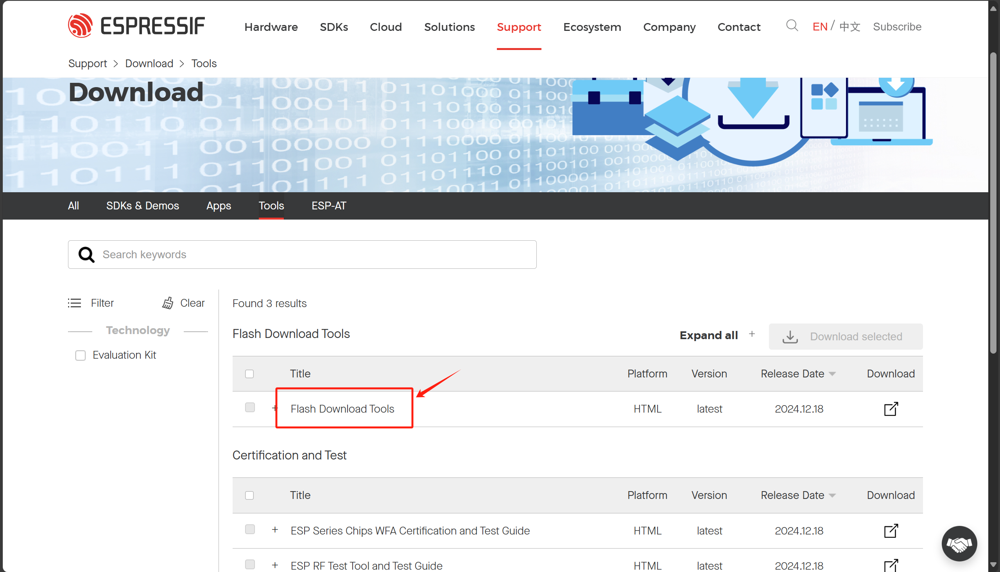
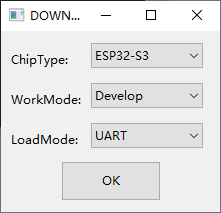
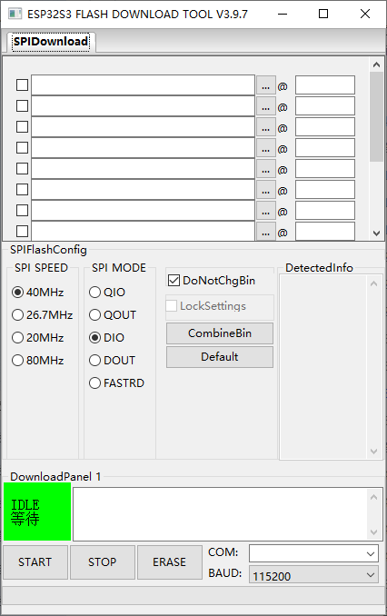
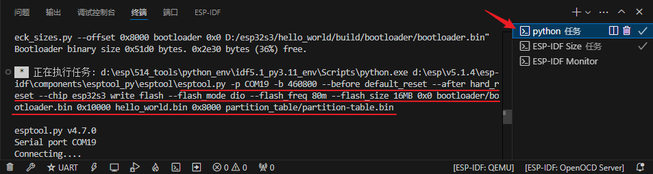
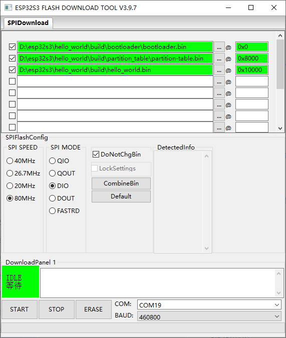
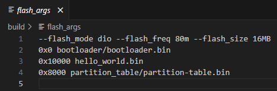
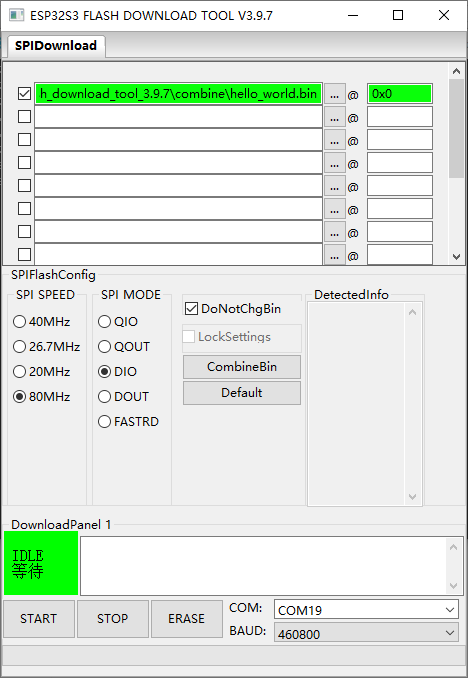

### **Using Flash Download Tool to Flash ESP32 Firmware**  

Previously, we flashed the firmware **directly from VSCode**, but now we will use **Flash Download Tool** to download the firmware onto the ESP32 board.  

---

## **1️⃣ Download Flash Download Tool**  
Flash Download Tool is an **official flashing tool from Espressif**, compatible with all ESP chips.  

📥 **Download Link:**  
🔗 [Espressif Flash Download Tool](https://www.espressif.com.cn/zh-hans/support/download/other-tools)  

1. Click on the **"Flash Download Tools"** button to download.  

2. After downloading, **double-click** `flash_download_tool_3.9.7.exe` to open the software.  

---

## **2️⃣ Configuring Flash Download Tool**  

### **1. Selecting Chip and Load Mode**  
- **ChipType:** Select the **ESP32-S3** chip.  
- **WordMode:** Choose **Develop** (for flashing a single board) or **Factory** (for flashing multiple boards in a production line).  
- **LoadMode:** Select **UART** (for serial flashing).  
- Click **OK** to continue.  

Now, the **flashing interface** will appear.

---

### **2. Gathering Flashing Information from VSCode**
In **VSCode**, when we flashed the firmware, the terminal output displayed **important details** for flashing manually.  

1. Open **VSCode** and go to the **bottom-right corner**.  
2. Click on **"Python Task"** in the terminal.  
3. Scroll up slightly to find the relevant flash details.

📌 **From VSCode, we extract the following information:**  

| Setting            | Value |
|--------------------|------|
| **Serial Port**    | COM19 |
| **Baud Rate**      | 460800 |
| **Flash Mode**     | DIO |
| **Flash Frequency** | 80M |

---

### **③ Locating the Binary (`.bin`) Files**  
We need to load **three `.bin` files** into Flash Download Tool:

| **File**             | **Location** |
|----------------------|-------------------------------------------|
| **bootloader.bin**   | `build/bootloader/bootloader.bin` |
| **hello_world.bin** (Application) | `build/hello_world.bin` |
| **partition-table.bin** | `build/partition_table/partition-table.bin` |

The **partition table** defines different sections in flash memory (similar to C:\ and D:\ drives on Windows).  
Later, we can create a **custom partition table** for AI models or file storage.

---

## **3️⃣ Flashing Firmware with Flash Download Tool**  

### **① Load the `.bin` Files**
1. **Bootloader** → Load `bootloader.bin` at **0x0**.  
2. **Application Firmware** → Load `hello_world.bin` at **0x10000**.  
3. **Partition Table** → Load `partition-table.bin` at **0x8000**.  

### **② Configure SPIFlash & Serial Port**  
- **Serial Port:** Set to **COM19**.  
- **Baud Rate:** **460800**.  
- **Flash Mode:** **DIO**.  
- **Flash Frequency:** **80M**.  

**Note:** You can also find this information in `build/flash_args` in VSCode.

---

### **③ Start Flashing**
Once the configuration is done:  
1. **Check the checkboxes** for all `.bin` files (only checked files will be flashed).  

2. Click **START** in the bottom-left corner.  
3. **Wait for the flashing process to complete.**  

📌 **Important Notes:**  
1. If you want to test different `.bin` files, you can load multiple files but only **check the ones you want to flash**.  
2. After flashing, the **ESP32 will not run automatically**. You must **press the reset button** or **power cycle the board**.

---

## **4️⃣ Merging `.bin` Files for Easier Flashing**
If you're preparing a **final firmware for production**, you can **merge the `.bin` files** into a single file.  

1. Click the **"CombineBin"** button in Flash Download Tool.  
2. The merged `.bin` file will be saved in the **`combine/`** folder as `target.bin`.  
3. Rename it to `hello_world.bin` for easier reference.  
4. In the future, flashing will only require this **one file**, making the process more efficient.

---

### **🎯 Summary**
- Download and install **Flash Download Tool**.
- Extract flashing details from **VSCode terminal**.
- Load **bootloader, application, and partition-table** binaries.
- Set **correct serial port and SPIFlash settings**.
- Click **START** to flash.
- **Press reset** after flashing to run the program.
- **Combine binaries** for simpler production flashing.

Now, your ESP32 firmware is successfully flashed! 🚀 Let me know if you need further help! 😊